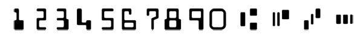

# MICR (E13B) Scanner #

Magnetic Ink Character Recognition OCR for the E13B font. This module assumes a cropped image of a check will be provided. The higher the resolution & clarity, the better the results.

## A brief explanation


The MICR character set includes 10 digits and 4 control characters. The four control characters are:

* transit (⑆) : bank branch delimiter
* amount (⑇): transaction amount delimiter
* on-us (⑈): customer account number delimiter
* dash (⑉): number delimiter

These characters are printed along the bottom of bank checks.

## Usage ##

The following assumes OpenCV.js is loaded and running in your environment and "mat" is a cv.Mat instance.

```javascript
// Create an MICRSCanner instance and provide the OpenCV object.
const scanner = new MICRScanner(cv);

// Scan an OpenCV Mat instance for MICR characters.
// Returns an array of strings.
const data = scanner.scanImage(mat);

// Example contents of data
// ["T011300142T","12345678U","0101"]
```

## Example ##

Included in this repository is an example implemented with NodeJS which can be run within the `/example` directory via:

```bash
node index.js
```

By default a sample check image is pre-loaded and scanned.  You may upload your own images to test.  Be sure that the image you upload is of a check image only.

## Thanks ##

* [OpenCV](https://opencv.org/) for creating an amazing toolkit.
* [PyImageSearch](https://pyimagesearch.com/2017/07/24/bank-check-ocr-with-opencv-and-python-part-i/) for a well documented and helpful tutorial to get things moving in the right direction.